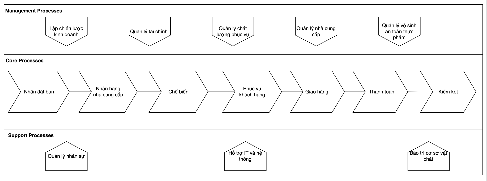

# 88 Griddle - Business Process Analysis & Modeling

> A Business Analysis case study focused on analyzing and modeling the operational processes of 88 Griddle restaurant (Thao Dien, Ho Chi Minh City).

## Project Overview

This project analyzes the end-to-end operational processes of **88 Griddle**, a restaurant operating in Thao Dien, Ho Chi Minh City.

The project focuses on translating real-world business operations into structured process models using **BPMN 2.0**, with the objective of making business activities, responsibilities, system interactions, decision points, and process flows easier to understand and analyze.

The analysis covers the restaurant's core operational processes from customer reservation and order fulfillment to payment and cash reconciliation.

### Project Focus

- Business Process Analysis
- As-Is Process Modeling
- BPMN 2.0
- Process Landscape Modeling
- Stakeholder & Process Analysis
- Pain Point Identification
- Process Improvement Opportunities
- To-Be Process Modeling

---

## Business Context

*88 Griddle* is a restaurant whose daily operations involve multiple stakeholders and interconnected operational processes.

The modeled processes involve interactions among:

- Customers
- Restaurant Management
- Service Staff
- Kitchen Staff
- Cashiers
- Suppliers
- Supporting systems

The project models how information, requests, decisions, and operational activities flow between these participants throughout the restaurant's operations.

Detailed business context and process descriptions are available in [`context/business-context.pdf`](context/business-context.pdf).

---

## Business Process Scope

The project covers **7 core operational processes**:

| Process | Primary Business Focus |
|---|---|
| Reservation | Receiving and processing customer table reservations |
| Supplier Receiving | Receiving and checking goods from suppliers |
| Kitchen Preparation | Preparing dishes based on received orders |
| Customer Service | Taking orders and serving customers |
| Delivery | Processing and completing online delivery orders |
| Payment | Verifying bills and processing customer payments |
| Cash Reconciliation | Checking cash, reconciling revenue, and handing over revenue |

---

## Process Landscape

The overall process landscape organizes the restaurant's operations into:

- **Management Processes**
- **Core Processes**
- **Support Processes**

The seven core processes represent the main operational flow of the restaurant, from receiving customer demand and preparing orders to service, delivery, payment, and cash reconciliation.



---

## As-Is Process Modeling

The current-state processes are modeled using **BPMN 2.0** to represent:

- Process participants and responsibilities
- Business activities
- System interactions
- Decision points and alternative flows
- Inputs and outputs
- Process loops and exception handling
- Handoffs between different stakeholders

### 1. Reservation

The reservation process begins when a customer contacts the restaurant to request a table.

The process handles different scenarios including available tables, unavailable tables, waiting lists, deposits, reservation confirmation, and reservation cancellation.


### 2. Supplier Receiving

This process models how the restaurant receives goods from suppliers and verifies both quantity and quality.

Exceptions such as insufficient quantity or unacceptable quality are handled through additional supply requests or return requests.


### 3. Kitchen Preparation

The kitchen receives order information from the system, prepares the dishes, and determines whether the order is for dine-in or delivery/takeaway before presenting or packaging the completed dishes.


### 4. Customer Service

The service process covers customer seating, menu presentation, order taking, order updates, coordination with the kitchen, serving dishes, handling additional orders, and dessert service.

The process also includes exception handling when a requested menu item is unavailable.


### 5. Delivery

The delivery process covers online orders from order preparation and packaging to customer contact, delivery, payment verification, successful completion, or order return when delivery is unsuccessful.


### 6. Payment

The payment process covers bill verification, deposit deduction, payment method selection, invoice handling, and customer information collection when a VAT invoice is requested.

Supported payment methods include cash, bank transfer, and card payment.


### 7. Cash Reconciliation

The cash reconciliation process covers end-of-shift cash checking, reconciliation between actual cash and recorded transactions, handling cash shortages, and revenue handover to management.


---

## Business Analysis

The BPMN models provide the foundation for further business analysis.

The analysis focuses on identifying:

### Stakeholder Insights

Understanding the responsibilities, interactions, and information dependencies among customers, management, service staff, kitchen staff, cashiers, suppliers, and supporting systems.

[`analysis/stakeholder-insights.md`](analysis/stakeholder-insights.md).

### Pain Points

Identifying process bottlenecks, unnecessary manual activities, information gaps, duplicated work, control weaknesses, and other operational issues observed or inferred from the current-state processes.

[`analysis/pain-points.md`](analysis/pain-points.md).

### Improvement Opportunities

Translating identified pain points into potential process improvement opportunities and defining areas where process standardization or system support could improve operational efficiency and control.

[`analysis/improvement-opportunities.md`](analysis/improvement-opportunities.md).

---

## To-Be Process Modeling

Based on the identified pain points and improvement opportunities, selected processes are redesigned into a **To-Be state**.

The To-Be model demonstrates how business process improvements can be translated into a more structured future-state workflow.

### Payment Process — To-Be


The To-Be model focuses on demonstrating how the identified improvement opportunities can be reflected directly in the future-state business process.

---

## BA Deliverables

| Deliverable | Description |
|---|---|
| Business Context | Business and operational context of the case |
| Process Landscape | High-level overview of restaurant processes |
| As-Is BPMN | Current-state modeling of 7 core processes |
| Stakeholder Analysis | Identification of stakeholders and their interactions |
| Pain Point Analysis | Analysis of issues within current processes |
| Improvement Opportunities | Proposed areas for process improvement |
| To-Be BPMN | Future-state process modeling for selected improvements |

---

## Tools & Techniques

**Modeling**
- draw.io
- BPMN 2.0

**Analysis**
- Business Process Analysis
- Stakeholder Analysis
- As-Is / To-Be Analysis
- Process Improvement Analysis

---

## Repository Structure

```text
88-griddle-business-process-analysis/
│
├── README.md
│
├── context/
│   └── business-context.pdf
│
├── process-modeling/
│   ├── process-landscape.png
│   │
│   ├── as-is/
│   │   ├── all-processes-bpmn.pdf
│   │   ├── reservation-bpmn.pdf
│   │   ├── supplier-receiving-bpmn.pdf
│   │   ├── kitchen-preparation-bpmn.pdf
│   │   ├── serving-bpmn.pdf
│   │   ├── delivery-bpmn.pdf
│   │   ├── payment-bpmn.pdf
│   │   └── cash-reconciliation-bpmn.pdf
│   │
│   └── to-be/
│       └── payment-to-be.pdf
│
└── analysis/
    ├── stakeholder-insights.md
    ├── pain-points.md
    └── improvement-opportunities.md
